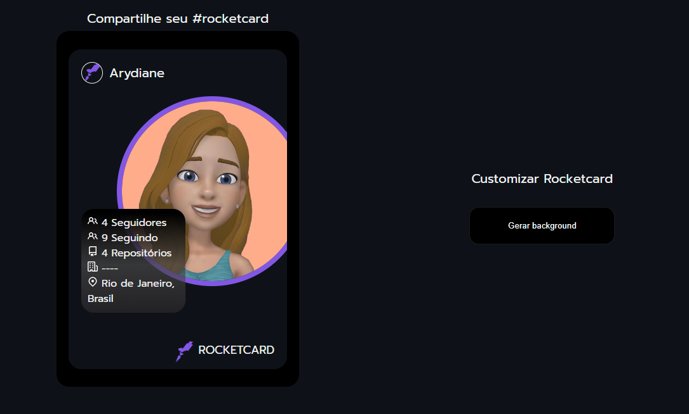

# Rocketcard
Desafio Rocketcard do Rocketseat

Desenvolver um card que traga as informações da API do Github e tenha um botão que altere a cor do fundo do card.

## 💻 Layout  

### Web

  

 ## 🔧 Tecnologias 

As tecnologias usadas foram: 
* HTML
* CSS
* JavaScript
